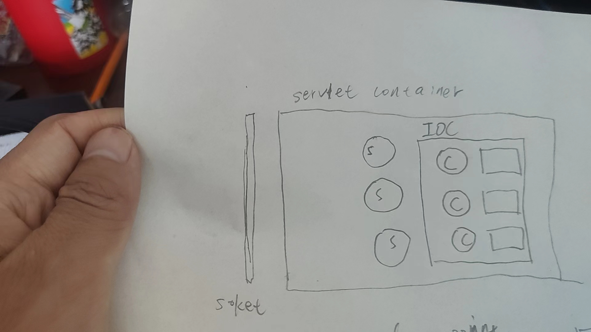

# Introduction 

[中文](./REAMDE_zh.md)

Tai-e-Security is a vulnerability detection tool based on the Tai-e Java static detection framework.

# Vulnerabilities Originating from

* Introduced by Containers

In the Java world, the concept of containers is diverse and these containers exist in a standardized form in the industry, such as the servlet container and its implementation Tomcat, the EJB container and its implementation JBoss, as well as the Java bean standard implementation by Spring.

* Introduced by Components

These components themselves cannot form a runnable program, such as Log4j, Fastjson, etc. Their vulnerabilities need to be exploited by being incorporated into a runnable program.

* Introduced by Business Logic

This part is the business side writing its own logic code based on the above Java infrastructure, such as various controllers, services, etc.

# Taint Analysis Detection

The main logic of taint analysis detection is based on existing vulnerability knowledge, collecting sources and sinks.

## Challenges Faced

* Where to start from the vulnerability introduction points mentioned above

We need end-to-end detection. Should we start from the container side? A more realistic and practical approach is to start from the parts we care about. For example, if we want to analyze the business logic part, we start from the controller part. If we want to analyze the vulnerabilities of the Spring framework itself, it's another approach.

* Difficulties in defining entry points and sources

In Java, many are based on declarative, such as various DSLs, Spring IOC xml is a kind of DSL, and various annotations are also a kind of DSL. This is a declaration of what I want, and the specific logic of how to do it is on the other side of the code and will involve reflection operations.

* So what is the ultimate difficulty

The ultimate difficulty is how to deal with reflection during the analysis, whether it is IOC, annotation, or proxy patterns.

* What are the solutions

I haven't figured out the universal level yet, looking forward to the framework such as Tai-e having its own reflection model, and I haven't delved into this part too deeply.

The framework works around from the perspective of use, and this direction can also have two sub-directions:

1. Based on the plugin mechanism provided by Tai-e, customize special processing in your own analysis field, and add your own entry points and sources.
2. Reflection expansion, that is, removing the magic syntax of reflection and expanding them into simple mobile ways. Some methods used in this repository are, for example, mocking all Spring controllers into a servlet.

# Todo list

- [x] jsp webshell
- [x] log4j shell
- [x] java-sec-code
- [x] servlet
- [x] spring controller