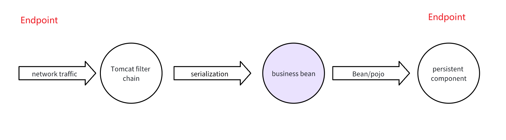

# Introduction

[中文](README_zh.md)

Tai-e-Security is a vulnerability detection tool based on the Tai-e Java static detection framework, primarily designed to address some engineering adaptation issues.

# Where are these Threats from


* Introduced by Containers

In the Java world, the concept of containers is diverse, and these containers exist in the industry in a standardized form, such as the servlet container and its implementation Tomcat, the EJB container and its implementation Jboss, and the Java bean reality standard Spring and its suite.

* Introduced by Components

These components themselves cannot form a runnable program, such as Log4j, Fastjson, etc. The exploitation of their vulnerabilities requires being incorporated into a runnable program.

* Introduced by Business Logic

This part is the business side writing its own logic code based on the above Java infrastructure, such as various controllers, services, etc.

# Who Introduces

* Developers

The above mainly explains the threats introduced inadvertently by third parties or their own developers.

* Hackers

Backdoors left by hackers, such as webshells, or other persistent Java class backdoors. If it is a backdoor, there will be code detection confrontation, such as shell exploitation using reflection, dynamic JavaScript engine script obfuscation, so the detection effect of JSP webshells aimed at hackers is relatively weaker.

# Taint Analysis Detection

The main logic of taint analysis detection is based on existing vulnerability knowledge, that is, sources and sinks.

## Difficulties Encountered

Facing a variety of codebases, we need to determine which part to audit, and there are two types of audits:
1. A complete business system, covering containers, various dependent components, and business logic beans.
2. Auditing a component without business logic alone.

One difficulty of the second method is how to reasonably define an effective source and whether it is widely present in reality, such as the log4j shell being hidden for so long, I think one of the reasons is that the log.error method as a source is not the top priority in the conventional audit thinking, because it is not as direct as HttpRequest.

## Auditing a Component Without Business Logic

Now most open source projects will have Unit tests, identifying reasonable and effective sources and entry points should be a valuable direction.

## Auditing a Complete Business System
This will involve a large number of components.

* Where to start from the above-mentioned threat introduction points

Currently, it is difficult to implement end-to-end detection, that is, traffic from the most direct entry Tomcat internal filter chain, we are more concerned about the part after the traffic enters the controller or servlet. Of course, there are also many vulnerabilities before that, such as the deserialization vulnerabilities of fastjson and jackson, and the deserialization vulnerability of shiro's cookie.
These vulnerabilities are exploited before entering the controller. This project also starts with the Spring controller and servlet as the entry point.



* Difficulties in Defining Entry Points and Sources

The ultimate difficulty is how to deal with reflection during analysis, whether it is IOC or annotation and proxy patterns. A lot of Java is based on declarative, such as various DSLs, Spring IOC xml is a kind of DSL, and various annotations are also a kind of DSL. This is a declaration of what I want, and the specific logic is on the other side of the code, and it will involve reflection operations.

What are the solutions? I haven't figured out the general level, looking forward to the framework such as Tai-e having its own reflection model, and I haven't delved into this part, what other ways are provided by the Tai-e framework to solve reflection, the following are two workaround directions:

## Custom Plugin (WIP)

Based on the plugin mechanism provided by Tai-e, customize special processing in your own analysis field, adding your own entry points and sources.

## Reflection Expansion

Reflection expansion, that is, removing the magic syntax of reflection and expanding them into simple ways. Some methods used in this repository are, for example, mocking all Spring controllers into a servlet.


The mock process here is organized and interdependent through gradle tasks.

### JSP or Servlet

For JSP, first use Jasper to convert JSP to a servlet.

### Spring Web

Expand all IOC injection functions into a procedural style.

``` java
import javax.servlet.*;
import javax.servlet.http.*;
import java.io.IOException;

public class MyServlet extends HttpServlet {
    @Override
    protected void doGet(HttpServletRequest request, HttpServletResponse response) throws ServletException, IOException {
        try {
            String mockInput = request.getParameter("mock");
            #foreach($controller in $controllerList)
                #set($ctrIndex= $foreach.index)
                ${controller.className} ctr$ctrIndex = new ${controller.className}();
                    #foreach($method in $controller.mappingItems)
                    ctr${ctrIndex}.${method.name}(#foreach($arg in $method.args)
                #if($arg=="javax.servlet.http.HttpServletRequest") request #elseif($arg=="javax.servlet.http.HttpServletResponse") response #else mockInput #end #if($foreach.hasNext),#end#end );
            #end
            #end
            response.getWriter().println("Hello, this is my servlet!");
        } catch (Exception e) {
            throw new RuntimeException(e);
        }
    }
}
```

# Todo List

- [x] JSP webshell
- [x] Log4j shell
- [x] Java security code
- [x] Servlet
- [x] Spring controller
- [ ] Unit test entry point

Please note that this is a direct translation, and some technical terms and code snippets may require further adjustment to fit into the context of the original document.
